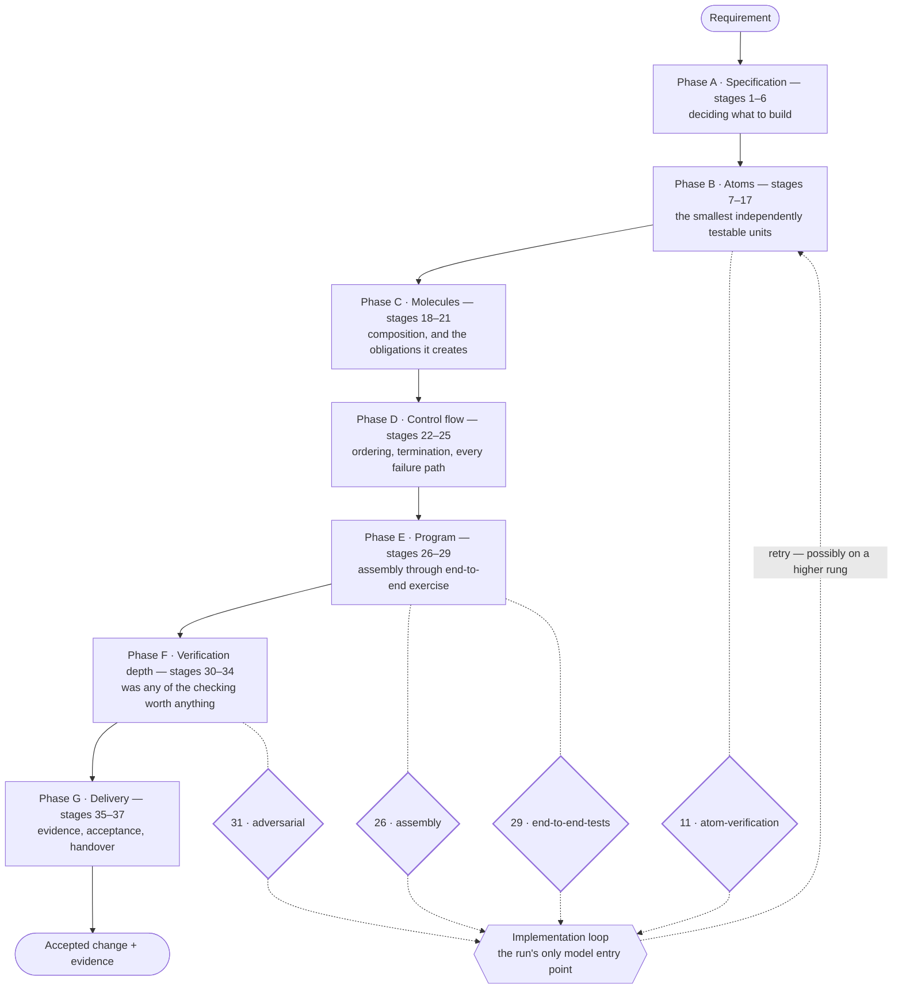
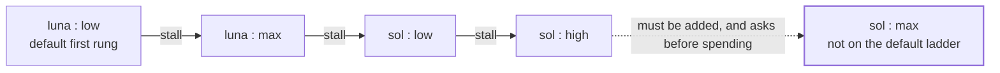

<div align="center">

# CodeFlux

**A coding agent that derives authority from what an action *is* —
never from what the model says it needs.**

[](https://github.com/monstercameron/codeflux/actions/workflows/ci.yml)
[](https://github.com/monstercameron/codeflux/actions/workflows/codeql.yml)
[](LICENSE)
[](go.mod)
[](#supported-platforms)
[](#project-status)

**[Quickstart](#quickstart) · [How it works](#how-it-works) · [What it will not do](#what-it-will-not-do) · [User guide](docs/using.md) · [Contributing](.github/CONTRIBUTING.md)**

</div>

---

## The argument

Most coding agents ask permission with a sentence the model wrote. You approve
the sentence. Then something else runs.

CodeFlux asks with the **exact action identity**: the tool, its ordered
arguments, and its declared effects. Approving `curl https://example.com` does
not approve `curl https://elsewhere`, and it does not approve the same URL
reached through a different tool. A denial is recorded against the *capability*,
not against the one tool you happened to be shown — so a refused action is not
quietly retried through a side door.

This matters because repository content is untrusted input. A poisoned `README`
can absolutely persuade a model to *propose* something hostile. It cannot
persuade CodeFlux that the proposal is authorized, because authority is never
derived from anything a model or a file asserts. That is the whole design, and
everything below follows from it.

The second commitment is narrower and just as load-bearing: **CodeFlux reports
what it knows, what is ambiguous, and what it recommends as three separate
things.** A forecast is a range, never a promise. An unreported price stays
`unknown` and is never rendered as zero. A passing validation means the checks
that ran passed — not that the change is correct. The execution graph explains
what happened; it does not prove that what happened was right.

An agent that overstates its own evidence is worse than no agent, because you
stop reading the diff.

---

## Quickstart

CodeFlux is **one executable**. It installs per user and never needs
administrator rights — a coding agent asking for elevation is asking for far
more trust than it needs.

```sh
# 1. Verify the download against its published SHA256SUMS, then put it on PATH.

# 2. Check the install. Reports every prerequisite as ok / missing / degraded /
#    failed / unknown, with a next step for anything that is not ok.
codeflux doctor

# 3. Connect one provider. The credential is read from standard input — never
#    from an argument, which every process on the machine can see and which
#    your shell history keeps — and is stored in the OS credential store.
codeflux provider set --name anthropic

# 4. Start. Binds loopback, opens your browser, prints the URL.
codeflux start
```

The session secret is **not** printed. A secret echoed to a terminal survives in
scrollback and in shell history; your browser receives it instead as an
HttpOnly, same-site cookie you never type. Use `--no-browser` to print the URL
and open it yourself.

Then, in the interface:

1. **Choose a repository.** A local Git repository with a clean working tree.
   Uncommitted changes are accepted only after you see and acknowledge exactly
   what they are — otherwise there is no way to tell your edits from the
   agent's.
2. **Describe an outcome** in your own words. No specification required.
3. **Read the plan.** CodeFlux proposes scope, steps, the checks it intends to
   run, and the authority it will need — before it does anything. Approve it or
   send it back.
4. **Watch it work.** Anything outside the task worktree stops and asks.
5. **Review the diff** and the evidence behind it. Nothing reaches your branch
   until you accept it.

Everything CodeFlux stores lives in one directory:

| Platform | Data directory |
| --- | --- |
| Windows | `%LOCALAPPDATA%\codeflux` |
| macOS | `~/Library/Application Support/codeflux` |
| Linux | `~/.local/share/codeflux` |

Delete that directory and CodeFlux is gone. Your repository is not part of it.

---

## What it actually does differently

### It never edits your checkout

Every task runs in its own Git worktree. You keep working while a task runs, and
nothing the agent does appears in the files you have open. A finished task
produces a diff plus the evidence behind it — what changed, which checks ran,
what they said. Accepting merges it. Until then, nothing has moved.

Rejecting a task **preserves** its patch instead of discarding it, so you can
still inspect work you decided not to take. Worktrees are cleaned up on a
terminal state — except one whose task ended ambiguously, which is kept, because
deleting it would destroy the only record of what happened.

### Repair is bounded, not a retry loop

When a validation fails, CodeFlux proposes a bounded repair rather than trying
again and hoping. A repair **resets the approval attached to the plan it
changes**, because evidence gathered against the old plan no longer describes
what will run.

### Money is exact, and unknown means unknown

Three things that are easy to confuse are kept apart: a **forecast** (an
estimate, shown as a range, never treated as a commitment), an **actual cost**
(what the provider charged), and **unknown** (the provider has not reported a
price). Unknown is never rendered as zero — a total that quietly counted unknown
as nothing would understate your spend exactly when it matters most.

All amounts are exact integer minor units. There is no floating point anywhere
in a cost. A **hard budget** stops new paid work when reached, lets in-flight
work settle, and leaves the task resumable. You raise the limit, finish, or
stop; CodeFlux does not decide for you.

### Memory that can be invalidated

CodeFlux remembers repository facts, reviewed commands, file-to-test mappings,
and conventions between tasks. An item is used only when it **applies** — same
project, same toolchain, same dependencies, evidence still holding. Similarity
is never treated as applicability: an item that *looks* relevant is not thereby
eligible.

Items record what they were **derived from** versus what merely **influenced**
them, and the distinction has teeth. Invalidating an item automatically
quarantines everything derived from it, because those conclusions depended on
it; things it only influenced are flagged for review. A quarantined item can
never regain authority — a new item must be established instead.

Vector search is off unless measured retrieval recall justifies turning it on,
and even then it proposes *candidates* only. It never confers eligibility,
validity, or permission.

### Crash recovery that admits what it cannot know

If CodeFlux, a worker, or your machine dies mid-task, the next start tells you
three things separately: **what is known** (the last durable checkpoint),
**what is ambiguous** (for example, whether a command that reached an external
system completed), and **what it recommends**.

When an external effect's outcome cannot be determined, you must reconcile it
before anything else proceeds. CodeFlux will not retry an ambiguous external
effect on your behalf — a duplicate charge, deployment, or message is not
something it can take back.

### Your data stays one file you can inspect

```sh
codeflux backup --output <path>        # consistent snapshot, while running;
                                       # never overwrites an existing file
codeflux integrity-check               # structurally sound (not "contents correct")
codeflux diagnostics export --output <path>
```

A diagnostics bundle carries versions, counts, and statuses — no requirement
text, no file contents, no model output — and is scanned before it is written.
Database inspection goes through a read-only surface where every entity maps to
a fixed parameterised statement; there is no free-text SQL door, and no path
that lets an inspection change anything.

Clearing the application log clears the log. Task evidence — events, plans,
approvals, validations, diffs — is stored separately and is untouched.

---

## How it works

```
                      ┌──────────────────────────────────────────┐
   your browser ──────┤  Go → WebAssembly frontend               │
   (loopback only)    │  GoWebComponents v5 · no handwritten JS  │
                      └───────────────────┬──────────────────────┘
                                          │ gRPC over WebSocket
                      ┌───────────────────┴──────────────────────┐
                      │  Coordinator (single process)            │
                      │  plans · authority · budgets · evidence  │
                      └──┬────────────┬──────────────┬───────────┘
                         │            │              │
              ┌──────────┴───┐  ┌─────┴──────┐  ┌────┴─────────────┐
              │ Worker procs │  │ Git        │  │ SQLite           │
              │ no raw creds │  │ worktrees  │  │ sole store       │
              └──────┬───────┘  └────────────┘  └──────────────────┘
                     │
              ┌──────┴────────────┐      ┌──────────────────────────┐
              │ Provider adapters │      │ OS credential store      │
              │ endpoint approval │──────┤ keys never touch SQLite, │
              └───────────────────┘      │ a log, or a worker       │
                                         └──────────────────────────┘
```

Four decisions explain most of the codebase:

**SQLite is the only authoritative store** for threads, messages, tasks, events,
graphs, atoms, vectors, evidence, budgets, and learned artifacts. No JSON, YAML,
or Markdown sidecars for runtime state. One transaction per user-visible
outcome.

**The frontend is Go.** The entire interface compiles to WebAssembly through
[GoWebComponents v5](https://github.com/monstercameron/GoWebComponents), talking
to the coordinator over gRPC-on-WebSocket via
[GoGRPCBridge](https://github.com/monstercameron/GoGRPCBridge). There is no
handwritten JavaScript, TypeScript, HTML, or CSS in the repository, and adding
some is a product-boundary violation rather than a style disagreement.

**Workers never receive raw provider credentials.** They are separate processes
with a deliberately narrow environment.

**`internal/domain` imports nothing infrastructural** — no SQLite, no provider,
no gRPC, no browser, no Git. The domain types are the part that has to stay
honest.

<details>
<summary><b>Repository layout</b></summary>

| Path | What lives there |
| --- | --- |
| `cmd/codeflux` | The user-facing executable |
| `cmd/codeflux-worker` | Task worker process |
| `cmd/codeflux-dev` | Every build, lint, test, and diagnostic gate |
| `internal/domain` | Stable domain types, infrastructure-free |
| `internal/coordinator` | Planning, authority, task lifecycle, projections |
| `internal/storage` | SQLite repositories, transactions, read-only inspection |
| `internal/events` | Journal and stream contracts |
| `internal/policy`, `internal/executor` | Authority derivation and tool execution |
| `internal/gitwork` | Worktrees, acceptance, rollback |
| `internal/providers` | Model provider adapters and approved transport |
| `internal/graph`, `internal/graphlayout` | Task-scoped execution graph |
| `internal/retrieval`, `internal/vectorsearch` | Memory eligibility and candidates |
| `internal/validation`, `internal/evidence`, `internal/review` | Checks and what they prove |
| `internal/forecast`, `internal/benchmarks` | Estimates and measurement |
| `internal/redact`, `internal/credentials` | Secret handling and scanning |
| `internal/devdiag` | Profiling and timing — off unless explicitly enabled |
| `web/frontend`, `web/client` | The Go/WASM interface |
| `api/proto` | Service definitions |
| `migrations/` | SQL migrations, immutable once merged |
| `.artifacts/` | The **only** place a tool or test may write |

</details>

---

## How a run produces code

A requirement does not go to a model and come back as a patch. It passes
through a declared flow of **37 stages in 7 phases**, each with a gate stating
what must hold for the stage to count as satisfied.



Three things in that picture are load-bearing.

**Tests come before the thing they test, and cases come before the tests.**
Stage 7 derives a ladder of inputs from the *signature* — straightforward,
degenerate, edge, complex, wrong, pathological — before any test is written. A
test written by reading an implementation checks what the code does; a case
derived from the contract checks what the signature promised, and those two
differ exactly where the bug is.

**Ordering within a phase is an argument, not a convention.** Anti-pattern
detection sits *after* verification because a swallowed error is neither a
compile error nor a test failure — no test written against current behavior
would ever catch one. Optimization may only run *after* mutation scoring,
because rewriting code guarded by tests nobody has shown can detect a defect is
how a behavior change reaches delivery with a green suite behind it.
Documentation comes *last*, after fuzzing and mutation, so it describes what the
atom is known to do rather than what its author meant.

**There is exactly one model entry point.** The other 36 stages are static
analysis, compilation, and running things. Four gates can send work back —
`atom-verification`, `assembly`, `end-to-end-tests`, `adversarial` — and the
rung the next attempt runs on is a real choice at each.

### The model ladder

A run climbs only when it **stalls** — three attempts failing identically — not
when something fails once.



Effort is exhausted on the cheap model before the expensive one is touched.
Raising effort bills more tokens at the rate already in force; changing model
raises the rate on *every* token. Medium is skipped on each model deliberately —
every rung costs a full stall to detect, so a rung only marginally better than
the one below it is paid for in attempts and returns nothing.

The top rung is off the default ladder entirely. Reaching it is the point where
a run stops being an experiment and becomes a decision about money, so a person
adds it and is asked before a run spends it.

### Outcomes are five, not two

| State | Means |
| --- | --- |
| `satisfied` | The gate held and the stage produced evidence |
| `failed` | The gate did not hold |
| `skipped` | This run had no need of it — a program with no parsing has nothing to fuzz |
| `blocked` | Something upstream did not happen, which is not the same as this stage failing |
| `not-implemented` | The product cannot perform this stage at all |

That last one exists because collapsing it into `skipped` would let a build
implementing a third of the flow report the same shape of result as one
implementing all of it.

> **The flow is declared; not all of it is performed.** `internal/pipeline`
> owns the vocabulary only — the ordered stages, the closed set of outcomes, and
> each stage's gate. It performs nothing and decides nothing about any run. The
> coordinator performs the stages it can and records the rest as
> `not-implemented`, which is the point: a flow whose missing stages are
> invisible looks identical to one that has none.

```mermaid
flowchart TD
    subgraph A["A · Specification"]
        direction TB
        a1["1 instructions"] --> a2["2 clarification"] --> a3["3 atomic-instructions"]
        a3 --> a4["4 decomposition-coverage"] --> a5["5 contracts"] --> a6["6 recall"]
    end

    subgraph B["B · Atoms"]
        direction TB
        b1["7 atom-case-synthesis"] --> b2["8 atom-example-tests"] --> b3["9 atom-property-tests"]
        b3 --> b4["10 atoms"] --> b5["11 atom-verification"] --> b6["12 atom-fuzz"]
        b6 --> b7["13 atom-mutation"] --> b8["14 anti-patterns"] --> b9["15 atom-optimization"]
        b9 --> b10["16 atom-complexity"] --> b11["17 atom-documentation"]
    end

    subgraph C["C · Molecules"]
        direction TB
        c1["18 composition-obligations"] --> c2["19 molecule-tests"]
        c2 --> c3["20 molecules"] --> c4["21 molecule-verification"]
    end

    subgraph D["D · Control flow"]
        direction TB
        d1["22 control-obligations"] --> d2["23 control-tests"]
        d2 --> d3["24 control-flow"] --> d4["25 path-coverage"]
    end

    subgraph E["E · Program"]
        direction TB
        e1["26 assembly"] --> e2["27 program"] --> e3["28 integration-tests"] --> e4["29 end-to-end-tests"]
    end

    subgraph F["F · Verification depth"]
        direction TB
        f1["30 global-invariants"] --> f2["31 adversarial"] --> f3["32 repetition"]
        f3 --> f4["33 platform-matrix"] --> f5["34 non-functional"]
    end

    subgraph G["G · Delivery"]
        direction TB
        g1["35 evidence-bundle"] --> g2["36 human-acceptance"] --> g3["37 deliver"]
    end

    a6 --> b1
    b11 --> c1
    c4 --> d1
    d4 --> e1
    e4 --> f1
    f5 --> g1
```

<details>
<summary><b>All 37 stages</b></summary>



Stage numbers order the flow; they are **not** identity. Inserting a stage
shifts every number after it, which is why the ledger records a stage's name
beside its number. A number answers "how far did this get"; only the name
answers "which check was this".

</details>

---

## What it will not do

These are documented limits, not gaps waiting to be filled. Read them before
deciding what to use CodeFlux for.

> **CodeFlux is not a security sandbox.** A command you approve runs as your
> user, with your files and your network. CodeFlux controls what gets *proposed*
> and what you are *asked about*; it does not contain what runs after you say
> yes. Container isolation is designed but not enabled. **Do not use CodeFlux as
> a boundary against code you do not trust.**

- **Prompt injection is mitigated, not solved.** Structural authority closes the
  direct path. It does not make a model immune to being *misled about what to
  propose* — which is exactly why the approval step exists and why it shows you
  the exact action.
- **Evidence is bounded by what was checked.** A green validation means those
  commands passed. Nothing more is claimed.
- **The graph is an explanation, not a proof.** It is projected from recorded
  events. Nothing in CodeFlux treats a graph node as evidence, and neither
  should you.
- **External systems may violate their contracts.** Providers report usage late
  or not at all; APIs act and then fail to respond. CodeFlux stays honest when
  this happens — it will tell you an outcome is unknown rather than guess — but
  it cannot make an external system behave.
- **Single machine, single user.** No multi-user model, no shared state, no
  server deployment. The coordinator binds loopback only.
- **Go-first.** Non-Go repositories open as explicitly labeled experimental
  inputs until a language-specific mapping and validation contract exists.
- **At most four active tasks**, and at most one active task per repository.

**Deliberately deferred**, so their absence is a decision rather than an
oversight: container and VM isolation · multi-user and team features · deep
verification (formal methods, property inference, semantic diffing) · hosted or
remote operation · automatic updates — an agent that can change your repository
and hold your credentials must not also replace its own executable unasked ·
provider fallback and routing · atom reuse at scale, which has a stated kill
criterion because whether reuse pays for itself is the open question the
prototype exists to answer.

---

## Project status

**Prototype. No stable release yet.** Milestones 00–23 are complete — 1,846
tasks covering the runtime, storage, transport, interface, graph, memory,
validation, harness, and local hardening. Milestone 24, the end-to-end vertical
slice and prototype exit, is roughly half done.

Expect breaking changes. Expect the database schema to move. Do not point this
at a repository you cannot afford to review carefully.

### Supported platforms

CI is authoritative. A platform without passing CI is experimental, not
supported.

| Platform | Status |
| --- | --- |
| Windows 11 ARM64 | Full quality gate + build |
| Windows Server 2025 AMD64 | Fast tests + build |
| macOS 15 ARM64 | Fast tests + build |
| Ubuntu 24.04 AMD64 | Fast tests + build + race detector |

---

## Development

Requires **Go 1.26.0+** and Git. Nothing else to build.

```sh
git clone https://github.com/monstercameron/codeflux.git
cd codeflux
go run ./cmd/codeflux-dev bootstrap     # verify and pin development tools
go run ./cmd/codeflux-dev test-fast     # the default suite
go run ./cmd/codeflux-dev build

git config core.hooksPath .githooks     # run the lint gate before each commit
```

| Command | Gate |
| --- | --- |
| `lint` | gofmt + vet + staticcheck + secret scan |
| `generate-check` | generated output is current |
| `test-fast` / `test-integration` / `test-race` | correctness |
| `test-security` | abuse suites |
| `test-browser` | mounted browser harness |
| `test-coverage` | coverage |
| `migration-check` | migration catalog consistency |
| `artifact-check` | artifact boundary + credential scan |
| `benchmark performance` | measurement |

**None of these reach the network.** The single command that does — `run-live` —
is deliberately excluded from every suite, so an ordinary test run can never
spend your money or depend on a provider being up.

CI invokes these same commands by the same names, and a test
(`TestM22_124_LocalAndCIShareTheSameCommandGraph`) enforces the correspondence —
a gate that existed only in the workflow would be a gate nobody could run before
pushing.

Two rules surprise people. **`.artifacts/` is the only place a tool may write**,
and `artifact-check` fails the build when something escapes. And **a passing run
writes nothing at all**, because an artifact directory full of successes is
noise nobody reads; an artifact means something failed.

---

## Documentation

| Document | For |
| --- | --- |
| [`docs/using.md`](docs/using.md) | Installing, providers, permissions, budgets, recovery, limitations |
| [`docs/developing.md`](docs/developing.md) | Failure artifacts, session replay, safe DB inspection, profiling, golden paths |
| [`docs/storage.md`](docs/storage.md) | Schema and durability |
| [`docs/benchmarks.md`](docs/benchmarks.md) | What is measured and how |
| [`docs/plan.md`](docs/plan.md) | The full design argument — authoritative for product intent, architecture, and scope |
| [`AGENTS.md`](AGENTS.md) | Repository-wide rules — authoritative for *how* changes are made |
| [`TODOS.md`](TODOS.md) | Dependency order and completion state |
| [`CHANGELOG`](CHANGELOG) / [`DEVLOG`](DEVLOG) | Commit outcomes and implementation chronology |

---

## Contributing

Please read [`.github/CONTRIBUTING.md`](.github/CONTRIBUTING.md) first — this
repository is governed more tightly than most its size, and a patch that ignores
the governance is declined no matter how good the code is. **Open an issue
before writing anything.**

Security issues go to
[private reporting](https://github.com/monstercameron/codeflux/security/advisories/new),
never a public issue. See [`.github/SECURITY.md`](.github/SECURITY.md) for what
is in scope — in particular, "an approved command did something bad" is
documented behavior, while "an unapproved command ran" is a vulnerability.

Much of this repository was written by a coding agent, which is expected to
continue. If you use one, point it at `AGENTS.md` first; the rules are not
discoverable from the code alone, and a capable agent that has not read them
will produce a confident, well-tested, unmergeable patch.

## License

[MIT](LICENSE) © 2026 Earl Cameron
